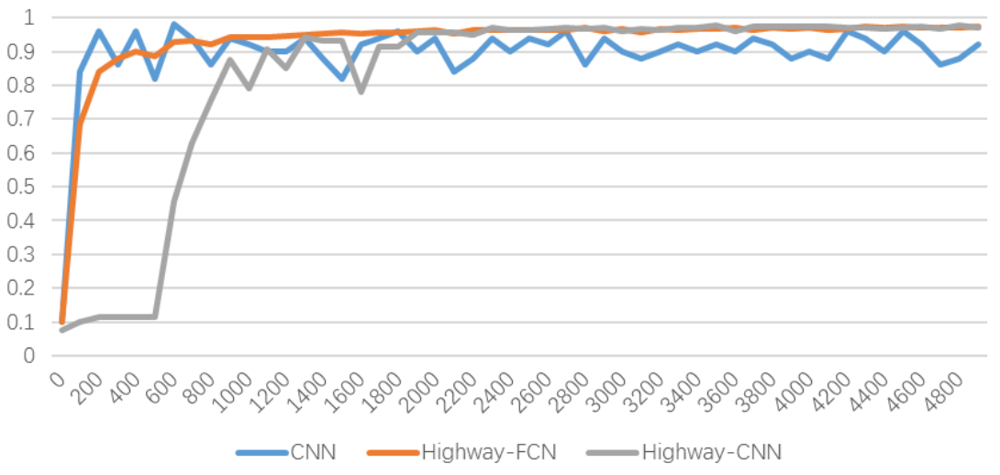
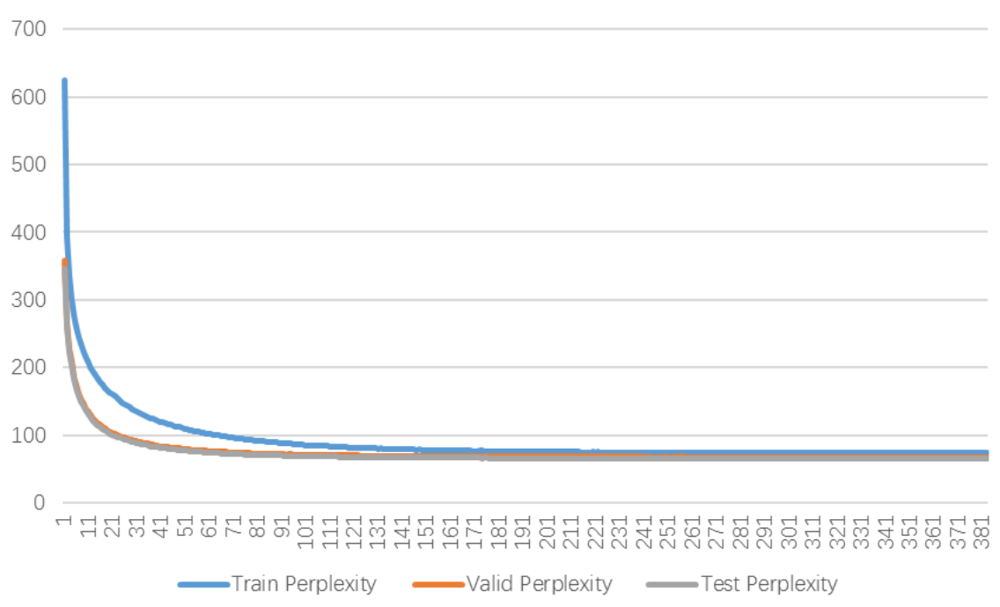

# Highway Networks @ Tensorflow
Implement Highway Networks based on Tensorflow 0.12.1

* Paper: 
  * [Highway Networks](https://arxiv.org/abs/1505.00387)
  * [Training Very Deep Networks](https://arxiv.org/abs/1507.06228)
* Dataset: 
  * [MNIST](http://yann.lecun.com/exdb/mnist/)

# Version
* CNN: Basic Convolutional Neural Networks implementation
* Highway-FCN: Fully-connected Highway Networks implementation
* Highway-CNN: Convolutional Highway Networks implementation

# Execution
1. Install Python, TensorFlow and other dependencies:
```
# Ubuntu/Linux 64-bit
$ sudo apt-get install python-pip python-dev

# Mac OS X
$ sudo easy_install pip
$ sudo easy_install --upgrade six
```
```
# CPU only
$ pip install tensorflow

# GPU enabled
$ pip install tensorflow-gpu
```
_You can also follow the [official guide](https://www.tensorflow.org/get_started/os_setup)._

2. Clone the repository:
```
$ git clone https://github.com/wujysh/highway-networks-tensorflow.git && cd highway-networks-tensorflow
```

3. Run: 
```
$ python {Version}.py
```
_Replace `{Version}` with `cnn`, `highway_fcn` or `highway_cnn`._

# Result
* Training convenience


* Accuracy
  * CNN: 92.14%
  * Highway-FCN: 96.77%
  * Highway-CNN: 97.68%

# Reproduce Recurrent Highway Networks
* Paper: [Recurrent Highway Networks](https://arxiv.org/abs/1607.03474)
* Code: [Github](https://github.com/julian121266/RecurrentHighwayNetworks)
* Experiment: (Perplexity - Epoch)


# Acknowledgement
* [Very Deep Learning with Highway Networks](http://people.idsia.ch/~rupesh/very_deep_learning/)
* [Recurrent Highway Networks](https://github.com/julian121266/RecurrentHighwayNetworks)
* [MNIST For ML Beginners](https://www.tensorflow.org/tutorials/mnist/beginners/)
* [Highway Networks with TensorFlow](https://medium.com/jim-fleming/highway-networks-with-tensorflow-1e6dfa667daa)
